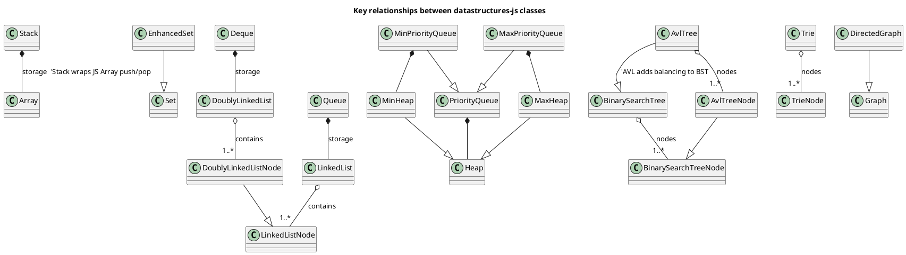

# JavaScript Data Structures
> https://github.com/datastructures-js/datastructures-js

```plantuml
@startuml
title Key relationships between datastructures-js classes

'─── Native “building-block” containers ──────────────────────────────
class Array
class Set

' EnhancedSet extends the native JS Set
class EnhancedSet
EnhancedSet --|> Set

'─── Linear collections ──────────────────────────────────────────────
class LinkedList
class LinkedListNode
LinkedList o-- "1..*" LinkedListNode : contains

class DoublyLinkedList
class DoublyLinkedListNode
DoublyLinkedList o-- "1..*" DoublyLinkedListNode : contains
DoublyLinkedListNode --|> LinkedListNode

class Stack
Stack *-- Array : storage  'Stack wraps JS Array push/pop

class Queue
Queue *-- LinkedList       : storage

class Deque
Deque *-- DoublyLinkedList : storage

'─── Heaps & priority queues ────────────────────────────────────────
class Heap
class MinHeap
class MaxHeap
MinHeap --|> Heap
MaxHeap --|> Heap

class PriorityQueue
PriorityQueue *-- Heap

class MinPriorityQueue
MinPriorityQueue --|> PriorityQueue
MinPriorityQueue *-- MinHeap

class MaxPriorityQueue
MaxPriorityQueue --|> PriorityQueue
MaxPriorityQueue *-- MaxHeap

'─── Trees ──────────────────────────────────────────────────────────
class BinarySearchTreeNode
class BinarySearchTree
BinarySearchTree o-- "1..*" BinarySearchTreeNode : nodes

class AvlTreeNode
class AvlTree
AvlTree --|> BinarySearchTree : 'AVL adds balancing to BST
AvlTreeNode --|> BinarySearchTreeNode
AvlTree o-- "1..*" AvlTreeNode : nodes

class TrieNode
class Trie
Trie o-- "1..*" TrieNode : nodes

'─── Graphs ─────────────────────────────────────────────────────────
class Graph
class DirectedGraph
DirectedGraph --|> Graph
@enduml
```
