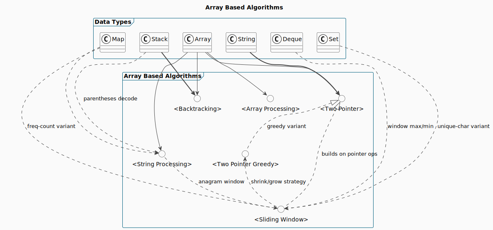
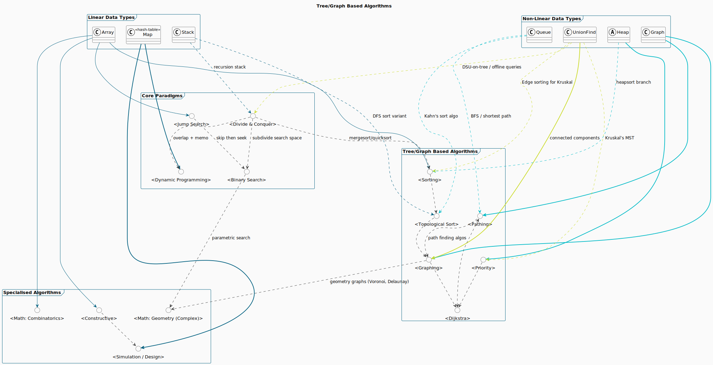

# Algorithms

## Hashing
Hashing is a technique used to map data of arbitrary size to fixed-size values, called `hash` values or `hash codes`, using a `hash` function. It is widely used in computer science for quick data retrieval and efficient storage.

#### Terminology
* **Key:** The input value to the hash function.
* **Hash Value:** The output of the hash function.
* **Bucket:** The location in the hash table where the key-value pair is stored.
* **Load Factor:** The ratio of the number of elements to the table size.

#### Collision resolution techniques
1. **Chaining:** Uses `linked lists` to store multiple elements in the same bucket. Each bucket points to a `linked list` of elements with the same `hash` value.

2. **Open Addressing:** All elements are stored directly in the `hash` table. On collision, the algorithm probes the table to find an empty slot. 

Probing Techniques:
* **Linear Probing:** Search sequentially for the next available slot. `index = (hash + i) % table_size`
* **Quadratic Probing:** Use quadratic intervals to find the next slot. `index = (hash + i^2) % table_size`
* **Double Hashing:** Use a second hash function to find the next slot. `index = (hash1 + i * hash2) % table_size`

#### What tree / graph algorithms shine at (the greatest hits)

| Theme                                | Canonical algorithms                                                                         | Typical questions they answer                                                                       | Real‑world systems & examples                                                                                                          |
| ------------------------------------ | -------------------------------------------------------------------------------------------- | --------------------------------------------------------------------------------------------------- | -------------------------------------------------------------------------------------------------------------------------------------- |
| **Connectivity & reachability**      | DFS/BFS, Union‑Find, Tarjan’s SCC                                                            | “Are *A* and *B* connected?” “How many components / islands exist?”                              | Link‑state routing (OSPF), social‑graph friend suggestions, detecting cycles in build dependency graphs.                               |
| **Shortest & cheapest paths**        | Dijkstra, A\*, Bellman‑Ford, Floyd‑Warshall, bidirectional search                            | “What is the minimum‑cost route from X to Y?”                                                       | Google Maps, GPS nav, network QoS routing, robot path planning in warehouses.                                                          |
| **Spanning structures & clustering** | Kruskal / Prim MST, Borůvka, DSU‑based clustering                                            | “Connect all nodes with the smallest total cost.”                                                   | Electrical grid layout, fiber/cable network design, image segmentation via minimal spanning forests.                                   |
| **Scheduling & dependency ordering** | Topological sort (Kahn / DFS), Critical‑Path Method, DAG DP                                  | “In which order can we compile packages?” “What’s the longest path in a DAG (project duration)?” | `make`/Bazel build systems, course‑prerequisite planning, CI/CD job ordering, project management tools.                                |
| **Network flow & matching**          | Ford‑Fulkerson, Edmonds‑Karp, Dinic, Hopcroft–Karp, Kuhn‑Munkres                             | “Max throughput between source & sink.” “Assign tasks to workers optimally.”                     | Airline scheduling, bipartite job matching, sports tournament brackets, cloud resource allocation, image stitching (max‑flow min‑cut). |
| **Indexing & spatial search**        | Binary‑Search Trees (AVL, Red‑Black), Segment / Fenwick / Interval trees, K‑d trees, R‑trees | “Store & query ordered or geometric data in log n or faster.”                                       | Database indexes (B‑tree variants), text editors’ rope structures, collision detection in games, GIS range queries.                    |
| **Heuristics, AI & game search**     | Min‑Max with α‑β pruning, Monte‑Carlo Tree Search                                            | “Choose the best move given branching factor.”                                                      | Chess/Go engines, real‑time strategy AI, automated theorem proving.                                                                    |
| **Graph analytics**                  | PageRank, HITS, Betweenness Centrality, community detection (Louvain, Girvan‑Newman)         | “Which nodes are most influential?” “How is the network clustered?”                              | Web‑search ranking, social‑network influence scores, fraud‑ring detection, recommendation engines.                                     |
