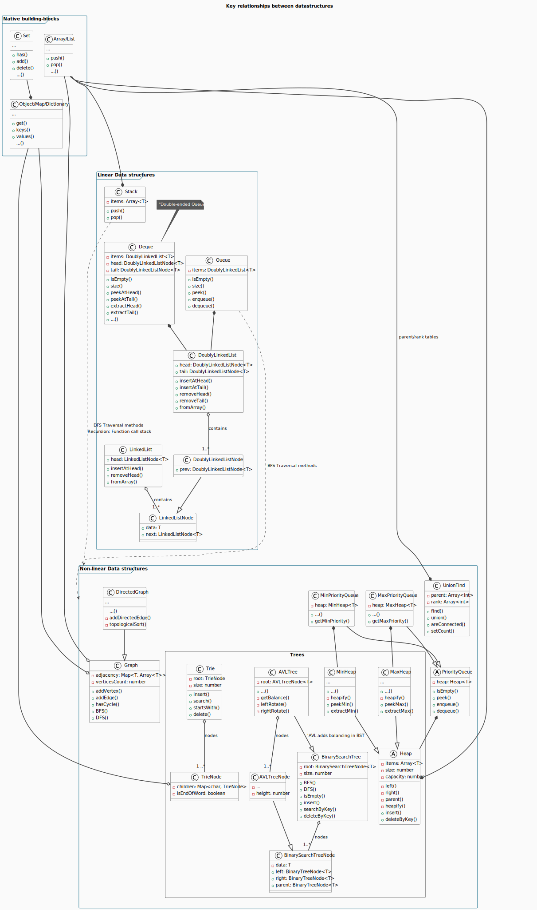

# Proveo's Data Structures / Abstract Data Types

> An alternate source: https://github.com/datastructures-js/datastructures-js



> Source: https://www.geeksforgeeks.org/dsa/lmns-data-structures/

## Arrays

Stores multiple elements of the same type in contiguous memory locations.

> Arrays can have `n` dimensions

## Linked Lists

Elements (called nodes) are connected using pointers. Unlike arrays, linked lists do not store elements in contiguous memory locations, making them dynamic and flexible for insertion and deletion operations.

#### Types of linked lists

- Singly: Each node points to the `next`. Last node points to `null`.
- Doubly: Each node contains 2 pointers: `next` and `prev`. Enables bidirectional traversion.
- Circular: The last node points to the first.
- Doubly Circular: Yes.

## Stacks

Follows the `Last In, First Out (LIFO)` principle, meaning the element added last is removed first. It is widely used in programming for tasks such as expression evaluation, backtracking, and function call management.

## Queues

Follows the `First In, First Out (FIFO)` principle. This means the element added first is removed first. Queues are widely used in scenarios like scheduling, buffering, and real-time systems.

#### Types of queue

- **Simple:** (FIFO).
- **Circular:** The last position connects to the first, for memory efficiency.
- **Priority:** Elements will get dequeued in a determined order.
- **Double-Ended:** Elements can be added/removed from both ends.

## Trees

Non-linear hierarchical data structure consisting of nodes connected by edges. Trees are widely used for organizing data and solving complex computational problems.

#### Terminology

- **Node:** Represents data.
- **Edge:** Connection between two `nodes`.
- **Degree:** The number of children a `node` has.
- **Binary Tree:** Tree: A `tree` where each `node` has at most two children.
- **Path:** A sequence of `nodes` connected by `edges`.

#### Types of trees

- **General:** Nodes have arbitrary children
- **Binary:** At most two children (`left` and `right`)
- **Binary Search Tree (BST):** It is organized where values are ordered as `left child` < `parent` < `right child`
- **Balanced Binary Tree:** A binary tree where the height difference between the left and right subtrees of any node is at most one. Examples: AVL Tree, Red-Black Tree.
- **Complete Binary Tree:** A binary tree where all levels are fully filled except possibly the last, which is filled from left to right.
- **Full Binary Tree:** Every node has either 0 or 2 children
- **Heap:** A complete binary tree used for `priority queues`. Types: `Min-Heap`, `Max-Heap`.
- **Trie:** A tree used for storing `strings` or `prefixes` efficiently.
- **N-ary Tree:** A tree where each node can have up to `N` children.

#### Tree traversal techniques

- **Depth-First Search** - Inorder Traversal (Left, Root, Right):
  - (i) Traverse the left subtree of root in inorder.
  - (ii) Process the root.
  - (iii) Traverse the right subtree of root in inorder.

```
        A
      /   \
     B     C
    / \   / \
   D   E F   G
```

> D, B, E, A, F, C, G

- **Depth-First Search** - Preorder Traversal (Root, Left, Right):
  - (i) Process the root.
  - (ii) Traverse the left subtree of the root in preorder.
  - (iii) Traverse the right subtree of the root in preorder.

```
        A
      /   \
     B     C
    / \   / \
   D   E F   G
```

> A, B, D, E, C, F, G

- **Depth-First Search** - Post-order:
  - (i) Traverse the left subtree of root in post-order.
  - (ii) Traverse the right subtree of root in post-order.
  - (iii) Process the root.

```
        A
      /   \
     B     C
    / \   / \
   D   E F   G
```

> D, E, B, F, G, C, A

- **Breadth-First Search** - Level Order Traversal: Visits nodes level by level

```
        A
      /   \
     B     C
    / \   / \
   D   E F   G
```

> A, B, C, D, E, F, G

#### Common operations on Trees

- **Insertion:** Add a node to the tree following specific rules (e.g., BST rules).
- **Deletion:** Remove a node while maintaining tree properties (e.g., replace with inorder successor in a BST).
- **Search:** Find a node in the tree. Time Complexity: O(log n) in a balanced tree; O(n) in a skewed tree

#### Binary Search Tree
  
Follows the rule: `left < root < right`. In-order traversal of a `BST` is `ASC`.

#### Heap

A tree that satisfies either the `Min-Heap` or `Max-Heap` property (by heapifying it on $O(log n)$):

- **Max-Heap:** The value of each parent node is greater than or equal to the values of its children.
  Example: `50, 30, 20, 15, 10, 8, 16 (root = 50).`
- **Min-Heap:** The value of each parent node is less than or equal to the values of its children.
  Example: `10, 15, 20, 30, 50, 40 (root = 10).`
  > A heap is commonly implemented as a `binary heap`, where it is represented as a `binary tree`.

#### AVL Tree

Self-balancing binary search tree (`BST`). Named after its inventors, Adelson-Velsky and Landis, it ensures that the `height` difference (balance factor) between the `left` and `right` subtrees of every node is at most `1`. This balancing helps maintain efficient operations such as insertion, deletion, and searching.

> https://www.geeksforgeeks.org/dsa/introduction-to-avl-tree/

## Graphs

A graph is a non-linear data structure consisting of `vertices` (`nodes`) and `edges` that connect pairs of vertices. Graphs are widely used to represent relationships between objects in various real-world scenarios like social networks, road maps, and web pages.

#### Graph Traversal Techniques

- **Depth First Search (DFS)**: Traverses as deep as possible along a branch before backtracking. Uses a `stack` (recursion or explicit).
- **Breadth First Search (BFS)**: Traverses all neighbors of a vertex before moving to the next level. Uses a `queue`.
  > All DFS use a `stack` and all BFS uses a `queue`.
